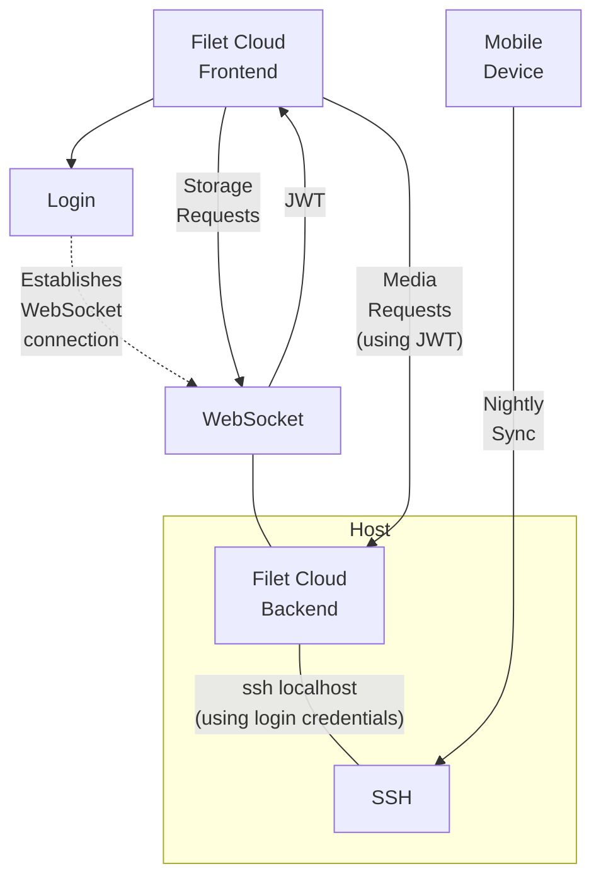

# ⛅ Filet Cloud
A simple and powerful personal cloud storage solution, with an elegant web interface.

Simple to self host, and adhering to the [file-over-app](https://stephango.com/file-over-app) philosophy, this gives you complete data privacy and full ownership over your own data. Its simple design provides a lean and fast web interface which connects via Websocket proxied SSH to the host's storage. You provision the storage host however you like, giving you full freedom on storage capacity.


Browse files, download, upload, stream videos and music, view images, create and edit documents.

## Features
* 📂 Browse folders.
* 📄 View and edit files in supported formats.
* 🖼 Fast preview viewing of thumbnail while large images load.
* ♫  Stream video and audio.
* 📂 Create new folders.
* 📄 Upload files.
* 🖊️ Rename files and folders.
* 📥 Download files.
* 🗄 Download multiple files or folders in a zip.
* 🚚 Move multiple files and folders.
* 🗑 Delete files and folders.
* 👤 Authentication via local SSH user account credentials, with optional support for 2FA.
* 👥 Supports multiple user accounts.
* 📱 Compatible with automatic phone data upload tools like Folder Sync Pro via the STFP/SSH service running on the same server.
* 📱 Mobile friendly.
* 🔐 Be in full control of your own private data.
* 💾 Maintains file-system ownership integrity consistent with local access, and stores all data in files on the underlying filesystem for superior data longevity.
* 🖼 Embed images and thumbnails in markdown documents using relative paths.
* 🔗 Link to other content from markdown documents using relative paths.
* 🌓 Dark and light modes.
* ⌨ Fast keyboard navigation.
* 🖥 Terminal access to the storage host.
* 💪 Hardened security.
* 🧩 Active folder plugins for creating custom commands which can autogenerate files such as photo albums, or disk usage reports.
* 🌏 Access from Firefox, Firefox mobile, Safari, Safari mobile, Chrome, Chrome mobile, and other Chromium based browsers.
* 👁 Customisable thumbnail generation command.

## Design
This design for this solution favors simplicity and minimalism, both inside and out, without losing powerful features. *Filet Cloud* pushes a personal cloud solution to its leanest essence. It leaves you fully in control of your own data. It is a joy to use because it does what it needs to, reliably and quickly, and then gets out of the way. The primary design philosophy for this project is: **"complexity must justify itself, ruthlessly"**.



### Active Folder Plugins
Create action plugins within your backend storage folders to run commands which can generate, update and open files. These will be displayed as action buttons when navigating to the folder they reside in.

Active folder plugins:
* Have their file name start with the prefix: `._filetCloudAction_` and end with the name of the action (with words separated by underscores), followed by an icon (any character, unicode, or symbol). E.g: `._filetCloudAction_full_backup🗄`
* Must be executable.
* Are run with the folder they reside in as the current working directory.
* Create standard output containing either the command output text log, or generated file contents.
* Have their standard output sent to an output file alongside the plugin file itself, with an underscore as a suffix.

On completion of the command, the browser will redirect to show the contents of the output file, or any file the output file links to.

This can be used for various actions, such as generating a photo album of all photos in a folder, displaying storage statistics, or even triggering a backup that runs in the background.

See the following examples which can be used or adapted as templates:
* [✋ Hello World](deployments/active-folder-plugins/._filetCloudAction_hello_world✋)
* [🗺 Template Markdown File Generator](deployments/active-folder-plugins/._filetCloudAction_make_markdown🗺)
* [🔴Template Background Script with Montoring](deployments/active-folder-plugins/._filetCloudAction_background_script🔴)
* [📊 Server Info Report with Markdown Formatting](deployments/active-folder-plugins/._filetCloudAction_info_📊)
* [🗄 Storage Status Report with Markdown Formatting](deployments/active-folder-plugins/._filetCloudAction_storage_status🗄)

### Supported formats
* Images
* Videos
* Audio
* PDF documents
* Markdown (with editing)
* Text (with editing)

### Security
Since this service proxies SSH credentials, and both serves and modifies personal data, hardened security policies have been implemented. Please use a modern up-to-date browser and device to make full use of these protections. For full details, see [SECURITY.md](SECURITY.md).

Disclaimer: Use at your own risk. The codebase is strikingly small and the dependencies few, so the aim is that a security audit, for whosoever wishes to do it, should be as easy as possible. Nothing is secure until it is audited and reviewed by peers.

### Internals
The code is organised across a minimal number files as a result of a heavily opinionated focus on simplicity through reducing the complexities of code interconnectivity:
* [main.go](main.go) - the primary server.
* [resources/main.html](resources/main.html) - the main frontend browser page.

No frontend framework is used because adopting one on top of the simple interface design would have introduced unjustified complexity.

No database is used, in favor of the simplicity and data longevity provided by a file-system-only solution.

## Deployment
You can use the basic deployment guide below, or simply use one of the provided template deployments:
* Energy Efficient High Capacity Deployment: [Raspberry Pi Zero W 2 with 4TB SSD and Auto Cert Domain](deployments/raspberry-pi-zero-2-w-ssd-autocert/README.md).
* Wee Mighty (Small Form Factor but High Power and Capacity): [Radxa Zero 3W with BTRFS snapshotted 4TB SSD and Auto Cert Domain](deployments/radxa-zero-3w-btrfs-ssd/README.md).
* Low Cost Simple Deployment: [Raspberry Pi Zero W with Micro SD on Home Network](deployments/raspberry-pi-zero-w-sdcard-no-domain/README.md).
* Spare Android Repurposed: [Android Termux on Home Network](deployments/android-termux/README.md).
* Advanced Configuration: [Raspberry Pi 4 with BTRFS snapshotted 4TB HDD, Nginx, and an information control E-ink HAT](deployments/raspberry-pi-4-btrfs-hdd-nginx-with-hat/README.md).

### Build
Install dependencies and build:

```bash
wget https://cdn.jsdelivr.net/npm/pdfjs-dist@3.11.174/build/pdf.min.js -O resources/deps/pdf.min.js
wget https://cdn.jsdelivr.net/npm/pdfjs-dist@3.11.174/build/pdf.worker.min.js -O resources/deps/pdf.worker.min.js
wget https://cdn.jsdelivr.net/npm/easymde@2.18.0/dist/easymde.min.css -O resources/deps/easymde.min.css
wget https://cdn.jsdelivr.net/npm/easymde@2.18.0/dist/easymde.min.js -O resources/deps/easymde.min.js
wget https://cdn.jsdelivr.net/npm/xterm@5.3.0/lib/xterm.js -O resources/deps/xterm.js
wget https://cdn.jsdelivr.net/npm/xterm@5.3.0/css/xterm.css -O resources/deps/xterm.css
wget https://cdn.jsdelivr.net/npm/xterm-addon-fit@0.8.0/lib/xterm-addon-fit.js -O resources/deps/xterm-addon-fit.js
go build
```
This creates a single file executable that internally contains all required resources.

### Install
* Ensure your machine allows ssh from localhost.
* Setup a certficate for TLS and ensure your browser respects it.
* Start server:
```bash
FC_CERT_FILE=my.crt FC_KEY_FILE=my.key ./filet-cloud
```
* Open in browser. Eg: `https://localhost/`

### Launch Options
Supported environment variables:
* `FC_CERT_FILE` & `FC_KEY_FILE`: The credentials to use for TLS connections.
* `FC_DIR`: The folder path to use when serving storage, rather than the root. Supports a USERNAME placeholder to serve a different tree for each user.
* `FC_DOMAIN`: The domain to use with the included Let's Encrypt integration. Use of this implies acceptance of the LetsEncrypt Terms of Service.
* `FC_LISTEN`: The address to listen on. Defaults to ':443'.
* `FC_SSH_PORT`: The port to use to connect locally.
* `FC_JPEG_CMD`: The command to make jpeg thumbnails by injecting parameters into PATH, WIDTH, and QUALITY placeholder values. PATH is the path to the source file and will be auto-quoted. WIDTH is the output JPEG width value. QUALITY is the output JPEG quality value (1-100). The command should write the output JPEG to standard out. The default value uses GStreamer.

### Certificate
If you don't have your own domain, you can set up TLS using a Self Signed Certificate with tools such as minica or openssl.

E.g, for testing locally:
```bash
openssl req -x509 -newkey rsa:4096 -sha256 -days 1 -nodes -keyout my.key -out my.crt -subj "/CN=localhost" -addext "subjectAltName=DNS:localhost,IP:127.0.0.1"
```

## Tips and Tricks
* The dynamic menu is contextual depending on what you have selected, and whether the cart mode is active or has contents.
* To use Copy/Paste in the terminal from a Linux client, use Ctrl/Shift+Insert rather than Ctr+c/v.
* Auto logout will cause terminal connections to end. Use a terminal multiplexer like zellij to provide persisent sessions across logins.
* NerdFont icons are fully supported and can be used for active folder plugin icons.
* Embed dynamically generated thumbnails inside markdown documents with the format suffix after the image path: ``. E.g: ``.
* GStreamer is used for the default FC_JPEG_CMD because it has excellent performance from leveraging various kinds of hardware acceleration. Other solutions can be used and ImageMagick gives a particularly simple example: `FC_JPEG_CMD=convert PATH -sample \>WIDTHx -quality QUALITY JPEG:-`
* You can normalise the quality value in the FC_JPEG_CMD if the command does not accept a normalised 1-100 quality range, like with ffmpeg: `FC_JPEG_CMD=ffmpeg -i PATH -q:v $((35-QUALITY/3)) -vf scale=WIDTH:-1 -update 1 -f image2 -vcodec mjpeg -`

# TODO (Current WIP)
* Backup active-folder plugin. Output file links to a backup output file. Command first outputs the message "Running in background - refresh to monitor...", flushes, then launches the backup in background with redirection of both channels to the backup output file, then returns. Add this as a long-running-actions tips and tricks.
* Update demo video (on firefox for mac with darkmode for better styling) - switch to Mobile phone view to demo profile view..
* Add to xtermjs tools list.

# Wish List for Future Work
* Improve EasyMDE enabling a simpler integration, better parsing so images and links inside literals aren't resolved, add link and image manipulation via callbacks, and fix its bug when deactivating the preview button on refresh. Perhaps write a new simpler MDE renderer with WASM (filet-web-mde).
* Make as a Progressive Web App (PWA).
* Active folder plugin for generating a photo album by making collection of markdown files for all photos in a folder.
* Improve CSP protection to inline stylesheets when xterm.js supports it. Other renderers or alternate tools could be options. See https://github.com/xtermjs/xterm.js/issues/4445
* Support Shift+Drag for terminal text selection (overriding passing mouse events) consistenly across client OSs, similar to Alacritty, with a new xtermjs option.
* Force selection in the terminal on macOS (https://github.com/xtermjs/xterm.js/issues/4329).
* Support for diagram editing and viewing (inside MDE).
* Support for slide deck editiing and viewing.
* Reduce complexity through more consistent behaviour of major browsers.
* Bring GStreamer 1.24 to Raspberry Pi installations for better image thumbnail flipping (this likely to come reasonable quickly).
* Linux support for power idling of devices like the Crucial X9 Pro.

# Thanks to
We stand on the shoulders of giants. They own this, far more than I do.
* https://stephango.com/file-over-app
* https://developer.mozilla.org/
* https://github.com/pkg/sftp
* https://github.com/gorilla/websocket
* https://golang.org/
* https://github.com/golang/crypto
* https://developer.mozilla.org/en-US/
* https://github.com/
* https://www.theregister.com
* https://www.nature.com/articles/s41586-021-03380-y
* https://stephango.com/file-over-app
* https://github.com/Ionaru/easy-markdown-editor
* https://mozilla.github.io/pdf.js/
* https://www.jsdelivr.com/
* https://github.com/AlDanial/cloc
* https://xtermjs.org/
* a world of countless open source contributors.
