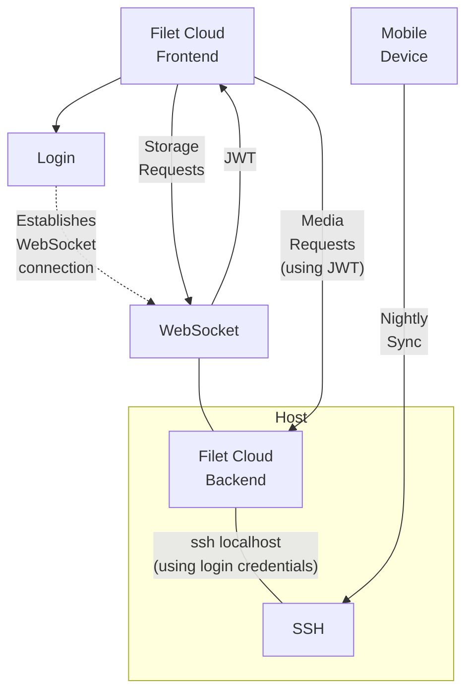

# ⛅ Filet Cloud
A minimalistic and powerful personal cloud storage with an elegant web interface, letting you control your data privacy, and leaving you with full ownership over your own data. This has a simple and elegant design that provides a lean web interface to hosted storage via a local ssh connection. You provision the storage host however you like, giving you full freedom on storage capacity.


Browse files, download, upload, stream videos and music, view images, create and edit documents.

## Supported formats
* Images
* Videos
* Audio
* PDF documents
* Markdown (with editing)
* Text (with editing)

## Features
* 📂 Browse folders.
* 📄 View and edit files in supported formats.
* 🖼 Fast preview viewing of thumbnail while large JPEG images load.
* ♫  Stream video and audio.
* 📂 Create new folders.
* 📄 Upload files.
* 🖊️ Rename files and folders.
* 📥 Download files.
* 🗄 Download multiple files or folders in a zip.
* 🚚 Move multiple files and folders.
* 🗑 Delete files and folders.
* 👤 Authentication via local SSH user account credentials.
* 📱 Compatible with automatic phone data upload tools like Folder Sync Pro via the STFP/SSH service running on the same server.
* 🔐 Be in full control of your own private data.
* 💾 Maintains file-system ownership integrity consistent with local access, and stores all data in files on the underlying filesystem for superior data longevity.
* 🖼 Embed images in markdown documents with relative paths.
* 🌓 Dark and light modes.
* ⌨ Fast keyboard navigation.
* 🖥 Terminal access to the storage host.
* 💪 Hardened security.
* 🧩 Active folder action plugins for creating custom commands which can autogenerate files such as photo albums, or disk usage reports.

## Design
This design for this solution favors simplicity and minimalism, both inside and out, without losing powerful features. *Filet Cloud* pushes a personal cloud solution to its leanest essence. It leaves you fully in control of your own data. It is a joy to use because it does what it needs to, reliably and quickly, and then gets out of the way. The primary design philosophy for this project is: **"complexity must justify itself, ruthlessly"**.



The code is organised in the following areas:
* [main.go](main.go) - the primary server.
* [resources/main.html](resources/main.html) - the main frontend browser page.

No frontend framework is used because adopting one on top of the simple interface design would have introduced unjustified complexity.

Note that auto logout will cause terminal connections to end. Using a terminal multiplexer like zellij or tmux provide persissent sessions across logins.

### Active Folder Action Plugins

Create action commands within your backend storage itself, which autogenerate or update files. These will be displayed as action buttons when navigating to the folder they reside in.

Active folder plugins must:
* Start with the prefix: `._filetCloudAction_`
* End with the name of the action, separated by underscores (_) followed by the action icon.
* Either output nothing, or
* Output the file or folder name, containing the results of the action, that should be redirected to.
* Be executable.

This can be used for various actions, such as generating a photo album of all photos in a folder, displaying storage statistics, or even triggering a manual backup.

## Build

Install dependencies and build:

```bash
wget https://cdn.jsdelivr.net/npm/pdfjs-dist@3.11.174/build/pdf.min.js -O resources/deps/pdf.min.js
wget https://cdn.jsdelivr.net/npm/pdfjs-dist@3.11.174/build/pdf.worker.min.js -O resources/deps/pdf.worker.min.js
wget https://cdn.jsdelivr.net/npm/easymde@2.18.0/dist/easymde.min.css -O resources/deps/easymde.min.css
wget https://cdn.jsdelivr.net/npm/easymde@2.18.0/dist/easymde.min.js -O resources/deps/easymde.min.js
wget https://cdn.jsdelivr.net/npm/xterm@5.3.0/lib/xterm.js -O resources/deps/xterm.js
wget https://cdn.jsdelivr.net/npm/xterm@5.3.0/css/xterm.css -O resources/deps/xterm.css
wget https://cdn.jsdelivr.net/npm/xterm-addon-fit@0.8.0/lib/xterm-addon-fit.js -O resources/deps/xterm-addon-fit.js
go build
```

## Install

* Ensure your machine allows ssh from localhost.
* Setup a certficate for TLS and ensure your browser respects it.
* Start server:
```bash
FC_CERT_FILE=my.crt FC_KEY_FILE=my.key ./filet-cloud
```
* Open in browser: `https://localhost/`

## Launch Options
Supported environment variables:
* `FC_CERT_FILE` & `FC_KEY_FILE`: The credentials to use for TLS connections.
* `FC_DIR`: The folder path to use when serving storage, rather than the root. Supports a USERNAME token to serve a different tree for each user.
* `FC_DOMAIN`: The domain to use with the included Let's Encrypt integration. Use of this implies acceptance of the LetsEncrypt Terms of Service.
* `FC_LISTEN`: The address to listen on. Defaults to ':443'.
* `FC_SSH_PORT`: The port to use to connect locally.

## Security
Since this service proxies SSH credentials, and both serves and modifies personal data, strict security policies have been implemented. Please use a modern and up-to-date browser and device to make full use of these protections.

Disclaimer: Use at your own risk. The codebase is strikingly small and the dependencies few, so the aim is that a security audit, for whosoever wishes to do it, should be as easy as possible. Nothing is secure until it is audited and reviewed by peers.

### Transport Security
* The login form will not open unless the connection protocol is HTTPS.
* HTTP requests to the main page are redirected to HTTPS.
* The backend implements a strict HTTPS ONLY policy.
* HTTP Strict Transport Security (HSTS) is enabled.
* All WebSocket connections use WebSocket Secure (WSS).
* The backend supports being provided TLS credentials otherwise it uses an included certbot integration.
* The webserver connects to the local SFTP/SSH service without verifying the SSH Host Key, therefore the connection between them cannot run across an untrusted network. Connecting to localhost is hardcoded to ensure this is the case. If you change this, ensure the HostKeyCallback is changed to use something secure, or reroute through a local connection using SSH port forwarding.

### Authentication
* Authentication is made by proxying the SSH credentials through the backend in establishing a local SSH connection managed by the backend.
* This primarily relies on SSH username and password authentication.
* 2FA can be additionally configured with a Pluggable Authentication Module (PAM).

### Login Session Managment
* On completion of the login form, an authenticated secure connection is established:
  * A WebSocket connection is established with the backend (with WSS).
  * The login credentials are passed directly to the WebSocket connection.
  * The backend passes the credentials directly into establishing an SFTP/SSH connection locally.
  * The SFTP/SSH connection is attached to the WebSocket connection to handle future requests.
  * The credentials are not stored in any persistent way.
  * Failure to establish an authenticated SFTP/SSH connection will close the WebSocket connection, triggering a new login sequence.
  * After sending the credentials to the WebSocket connection, the login form will pass the potentially authenticated WebSocket connection to be stored inside an instance of the Storage class in a private variable, so as to restrict direct access from JavaScript except via its API. Note that this is also shared with the terminal element.
* The user may choose to store the credentials in the browser's password management system, if supported and enabled in the browser. For additial security, 2FA is recommended.
* Logout occurs when either the browser or the backend closes the WebSocket connection, such as:
  * Automatically when closing or refreshing the browser tab.
  * When restarting the backend service.
  * From a disruption to the network connection.
* Logout closes the WebSocket connection, triggering the server to close its end and invalidate any established authentication cookies.
* Automatic logout will also occur 5 minutes after a page remains not visible, such as after navigating to a new page, switching tabs, minimising the browser, or, on mobile, switching to another app.
* Logging out via the logout button will additionally cleaer all site data, as supported by the browser.

### Authorised Browser Access to Content
* Along with storage requests being served via the authenticated WebSocket connection, authorised access is extended to the browser to allow the display of media and content, and for downloads.
* Extension of authorised access to the browser is achieved via the following process:
  * On login, the Storage class will:
    * Use the authenticated WebSocket connection to request an authentication JSON Web Token (JWT), which is created by the backend with the following JWT payload:
      * The remote address IP (which is never stored persistently by the backend) of the authenticated WebSocket connection's client side, as the Registered Audience Claim (aud).
      * A time of 5 minutes later, as the Registered Expiration Time Claim (exp).
      * A sequential identifier uniquely associated with the authenticated WebSocket connection, as the Registered Subject Claim (sub).
    * Prevent exposure of the authorization JWT to JavaScript contexts outside of the Storage class.
    * Send the JWT, via request body, to the backend's /authenticate endpoint so it can instruct the browser to set the JWT as an authentication cookie with the following cookie attribute protections:
       * The browser only uses the authentication cookie in requests back to the site's own originating site, by setting SameSite=Strict.
       * The browser expires the cookie after 5 minutes, by setting Max-Age=300.
       * The authorization JWT is protected from JavaScript access, by setting HttpOnly.
       * The cookie is further protected by setting the Secure cookie attribute, and by giving the cookie the secure `__Host-` prefix.
    * While the login session remains active, the Storage Class will keep the JWT refreshed by repeating this process on intervals.
  * Requests to any storage link (via the `/file:/` `/thumb:/` and `/zip` URL paths) will succeed only if the backend's checks of the authentication JWT cookie is successfully validated against the following policy:
    * The JWT is correctly signed.
    * The remote address IP of the request must match the JWT's Registered Audience Claim.
    * The JWT's Registered Expiration Time Claim must not have expired.
    * The JWT's Registered Subject Claim must exactly match a unique identifier associated with an authenticated WebSocket connection, which is then used to fulfill the storage request.
  * The JWT is signed using HS512 with a crytographically secure pseudorandom key generated on launch of the server.

### Site Isolation and Content Protection
* Same-Origin Policy is enforced.
* Cross Origin Isolation is enforced by:
  * Setting the Cross Origin Opener Policy to ensure the browsing context is exclusively isolated to same-origin documents.
  * Setting the Cross Origin Embedder Policy to require corp (Cross Origin Resource Policy).
  * Ensuring Cross Origin Isolation is fully activated by checking that the crossOriginIsolated property in the browser is active, before opening the login form.
  * Default Cross Origin Read Blocking browser protections are enhanced by all Content Type Options being configured with nosniff, and with the Content-Type header being set.
* Cross Origin Resource Policy is configured to same-origin so that all resources are protected from access by any other origin.
* Content Security Policy is enforced with a configuration that ensures:
  * Image, font and media content can be loaded only from the site's own origin.
  * Script resources can be loaded only from the site's own origin or from inline elements protected with a 128 bit cryptographically secure random nonce.
  * Stylesheet resources can be loaded only from the site's own origin or from inline elements.
  * WebSockets can only be connected to the site own origin.
  * Contents that do not match the above types, are denied.
  * All content is loaded sandboxed with restricted allowances.
  * Documents are prevented from being embedded.
  * Forms are denied from using URLs as the target of form submission.
* The backend requires the browser to provide Secure Fetch Metadata Request Headers, and denies access to content unless the following policies are met:
  * For the main page:
    * The request destination is a document, preventing embedding.
  * For the `/resources/` URL path:
    * The request site is same-origin.
    * The request destination is a script, style or font element.
  * For the `/connect` endpoint:
    * The request site is same-origin.
    * The request mode is a websocket.
    * The request destination is empty.
  * For the `/authenticate` endpoint:
    * The request site is same-origin.
    * The request destination is empty.
  * For `/file:/` `/thumb:/` and `/zip` URL paths:
    * The request site is same-origin.
    * The request destination is audio, an image, a video, or a document.
* The backend enforces a browser cache policy which ensures cached content access adheres to the above Secure Fetch Metadata Request Header policy, including when the headers vary across subsequent requests.
* A Referrer Policy of same-origin is enforced.

### Additional Cross-Site Request Forgery (CSRF/XSRF) Protection
* The login form is protected with a CSRF Token secured by an HMAC-SHA256 Signed Double-Submit Cookie.
* All backend endpoints which cause any changes or side effects (besides server load or establishing authentication), are only accessible through the WebSocket connection.
* The WebSocket connection is stored in a private variable, inside the Storage class, and is only accessible via it's restricted API.

### Third-Party Dependencies
* All third-party dependencies are servered from the backend and are version controlled and stored locally.
* All third-party dependencies loaded in the browser are Subresource Integrity checked.
* Cache-Control is enforced so the browser caches content for no longer than 10 hours.

## Development Testing
To set up TLS you could use a Self Signed Certificate with tools such as:
```bash
openssl req -x509 -newkey rsa:4096 -sha256 -days 1 -nodes -keyout my.key -out my.crt -subj "/CN=localhost" -addext "subjectAltName=DNS:localhost,IP:127.0.0.1"
openssl pkcs12 -export -in my.crt -inkey my.key -out my.p12
```

# Thanks to
We stand on the shoulders of giants. They own this, far more than I do.

* https://developer.mozilla.org/
* https://github.com/pkg/sftp
* https://github.com/gorilla/websocket
* https://golang.org/
* https://github.com/golang/crypto
* https://developer.mozilla.org/en-US/
* https://github.com/
* https://www.theregister.com
* https://www.nature.com/articles/s41586-021-03380-y
* https://stephango.com/file-over-app
* https://github.com/Ionaru/easy-markdown-editor
* https://mozilla.github.io/pdf.js/
* https://www.jsdelivr.com/
* https://github.com/AlDanial/cloc
* https://xtermjs.org/
* a world of countless open source contributors.

# Tricks and Tips

* Copy/Paste in the terminal on Linux: Use Ctrl/Shift + Insert.

# TODO
* Incorporate into https://github.com/fuglaro/filet-cloud
* Installation enhancement pass
  * New RP4 release without hat.
  * Monitor storage interval access (maybe backup interval is an issue - maybe only backup when things change) for allowing the storage to power down.
  * Mobile phone version with battery pack and 4G for always on.
  * Swap to RP3A+ for low power and compact.
  * Connect via cable.
  * Android Termix.
  * Allow COLORTERM env though ssh.
  * https - accept certs via env var or auto setup with let's encrypt autocert NewListener (with domain provided by FC_DOMAIN).
    * Remove nginx.
    * Switch to included autocert.
  * Setup and test 2FA
  * Storage status active folder plugin.
  * Backup active folder plugin.
* Retest IOS, Safari, Chrome, Chrome Mobile.
* Check todo list stored on cloud server.
* Update demo video (on firefox for mac with darkmode for better styling).
* Tag easily deployable release for others, with wide cross compiling ARM/x86/x64/RISC-V Linux/LinuxStaticMusl/Mac/Windows.

# Wishlist for future work
* Improve EasyMDE enabling a simpler integration.
* Make as a Progressive Web App (PWA).
* Active folder action plugin for generating a photo album by making collection of markdown files for all photos in a folder.
* Active folder action plugin for getting storage statistics and status diagnostics.
* Improve CSP protection to inline stylesheets when xterm.js supports it. Other renderers or alternate tools could be options. See https://github.com/xtermjs/xterm.js/issues/4445
* Force selection in the terminal on macOS (https://github.com/xtermjs/xterm.js/issues/4329).
* Support for diagram editing and viewing.
