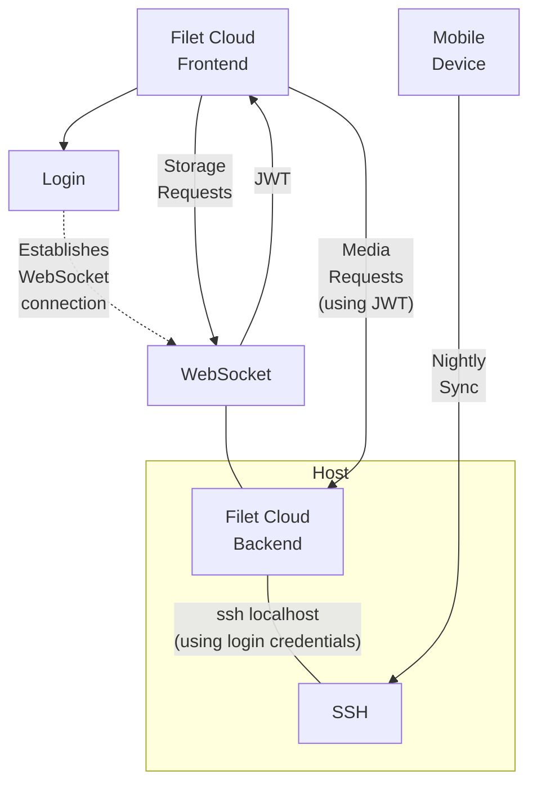

# Filet Cloud Web
Web service for a minimalistic personal cloud storage, letting you control your data privacy. This has a simple and elegant design that provides a lean web interface to local storage via a local ssh connection.


Browse files, download, upload, stream videos and music, view images, create and edit documents.

## Supported formats
* Images
* Videos
* Audio
* PDF documents (via pdfjs)
* Markdown (with editing via easyMDE)
* Text (with editing)

## Features
* Authentication via local user account credentials.
* Browse folders.
* View and edit files in supported formats.
* Stream video and audio.
* Create new folders.
* Upload files.
* Rename files and folders.
* Download files.
* Download multiple files or folders in a zip.
* Move multiple files and folders.
* Delete files and folders.
* Maintains file-system ownership integrity consistent with local access.
* Compatible with automatic phone data upload tools like Folder Sync Pro via the STFP/SSH service running on the same server.
* Be in full control of your own private data.

## Design

This design for this solution favors simplicity and minimalism, both inside and out, without losing powerful features. *Filet Cloud Web* pushes a personal cloud solution to its leanest essence. It leaves you fully in control of your own data. It is a joy to use because it does what it needs to, reliably and quickly, and then gets out of the way. The primary design philosophy for this project is: **"complexity must justify itself, ruthlessly"**.



The code is organised in the following areas:
* [main.go](main.go) - the primary server.
* [static/main.html](static/main.html) - the main frontend browser page.

No frontend framework is used because adopting one on top of the simple interface design would have introduced unjustified complexity.

## Security

Since this service proxies SSH credentials, and both serves and modifies personal data, strict security policies have been implemented. Please use a modern and up-to-date browser and device to make full use of these protections.

Disclaimer: Use at your own risk. The codebase is strikingly small and the dependencies few, so the aim is that a security audit, for whosoever whishes to do it, should be as easy as possible. Nothing is secure until it is audited and reviewed by peers.

### Transport Security
* The login form will not open unless the connection protocol is HTTPS.
* HTTP requests to the main page are redirected to HTTPS.
* The backend implements a strict HTTPS ONLY policy.
* HTTP Strict Transport Security (HSTS) is enabled.
* All WebSocket connections use WebSocket Secure (WSS).
* The Content Security Policy is configured to ensure that content is only loaded via HTTPS.
* The backend supports being provided TLS credentials otherwise it uses an included certbot integration.
* The webserver connects to the local SFTP/SSH service without verifying the SSH Host Key, therefore the connection between them cannot run across an untrusted network. Connecting to localhost is hardcoded to ensure this is the case. If you change this, ensure the HostKeyCallback is changed to use something secure.

### Authentication
* Authentication is made by proxying the SSH credentials through the backend in establishing a local SSH connection managed by the backend.
* This primarily relies on SSH username and password authentication.
* 2FA can be additionally configured with a Pluggable Authentication Module (PAM).

### Login Session Managment
* On completion of the login form, an authenticated secure connection is established:
  * A WebSocket connection is established with the backend (with WSS).
  * The login credentials are passed directly to the WebSocket connection.
  * The backend passes the credentials directly into establishing an SFTP/SSH connection locally.
  * The SFTP/SSH connection is attached to the WebSocket connection to handle future requests.
  * The credentials are not stored in any persistent way.
  * Failure to establish an authenticated SFTP/SSH connection will close the WebSocket connection, triggering a new login sequence.
  * After sending the credentials to the WebSocket connection, the login form will pass the potentially authenticated WebSocket connection to be stored inside an instance of the Storage class in a private variable, so as to restrict direct access from JavaScript except via its API.
* Logout occurs when either the browser or the backend closes the WebSocket connection, such as:
  * Automatically when closing or refreshing the browser tab.
  * When restarting the backend service.
  * From a disruption to the network connection.
* Automatic logout will also occur 5 minutes after a page remains not visible, such as after navigating to a new page, switching tabs, minimising the browser, or, on mobile, switching to another app.
* Logout events will trigger all cached site data to be cleared. Cached site data may not be cleared if the browser exits uncleanly or the backend is not contactable.
* The user may choose to store the credentials in the browser's password management system, if supported and enabled in the browser. For additial security, 2FA is recommended.

### Site Isolation and Content Protection
* Same-Origin Policy is enforced.
* Cross Origin Isolation is enforced by:
  * Setting the Cross Origin Opener Policy to ensure the browsing context is exclusively isolated to same-origin documents.
  * Setting the Cross Origin Embedder Policy to require corp (Cross Origin Resource Policy).
  * Ensuring Cross Origin Isolation is fully activated by checking that the crossOriginIsolated property in the browser is active, before opening the login form.
  * Default Cross Origin Read Blocking browser protections are enhanced by all Content Type Options being configured with nosniff, and with the Content-Type header being set.
* Cross Origin Resource Policy is configured to same-origin so that all resources are protected from access by any other origin.
* Content Security Policy is enforced with a configuration that ensures:
  * Image, font and media content can be loaded only from the site's own origin.
  * Script and stylesheet resources can be loaded only from the site's own origin or from inline elements protected with a 128 bit cryptographically secure random nonce.
  * WebSockets can only be connected to the site own origin.
  * Contents that do not match the above types, are denied.
  * All content is loaded sandboxed with restricted allowances.
  * Documents are prevented from being embedded.
  * Forms are denied from using URLs as the target of form submission.
* The backend requires the browser to provide Secure Fetch Metadata Request Headers, and denies access to content unless the following policies are met:
  * For the main page:
    * The request site is set to none, ensuring user initiated access.
    * The request destination is a document, preventing embedding.
  * For the `/static/` URL path:
    * The request site is same-origin.
    * The request destination is a script or style element.
  * For the `/connect` endpoint:
    * The request site is same-origin.
    * The request mode is a websocket.
    * The request destination is empty.
  * For the `/authenticate` endpoint:
    * The request site is same-origin.
    * The request destination is empty.
  * For `/file:/` `/thumb:/` and `/zip` URL paths:
    * The request site is same-origin.
    * The request destination is audio, an image, a video, or a document.
* The backend enforces a browser cache policy which ensures cached content access adheres to the above Secure Fetch Metadata Request Header policy, including when the headers vary across subsequent requests.
* A Referrer Policy of same-origin is enforced.

### Authorised Browser Access to Content
* Along with storage requests being served via the authenticated WebSocket connection, authorised access is extended to the browser to allow the display of media and content, and for downloads.
* Extension of authorised access to the browser is achieved via the following process:
  * On login, the Storage class will:
    * Use the authenticated WebSocket connection to request an authentication JSON Web Token (JWT), which is created by the backend with the following JWT payload:
      * The remote address IP (which is never stored persistently by the backend) of the authenticated WebSocket connection's client side, as the Registered Audience Claim (aud).
      * A time of 5 minutes later, as the Registered Expiration Time Claim (exp).
      * A sequential identifier uniquely associated with the authenticated WebSocket connection, as the Registered Subject Claim (sub).
    * Prevent exposure of the authorization JWT to JavaScript contexts outside of the Storage class.
    * Send the JWT, via request body, to the backend's /authenticate endpoint so it can instruct the browser to set the JWT as an authentication cookie with the following cookie attribute protections:
       * The browser only uses the authentication cookie in requests back to the site's own originating site, by setting SameSite=Strict.
       * The browser expires the cookie after 5 minutes, by setting Max-Age=300.
       * The authorization JWT is protected from JavaScript access, by setting HttpOnly.
       * The cookie is further protected by setting the Secure cookie attribute, and by giving the cookie the secure `__Host-` prefix.
    * While the login session remains active, the Storage Class will keep the JWT refreshed by repeating this process on intervals.
  * Requests to any storage link (via the `/file:/` `/thumb:/` and `/zip` URL paths) will succeed only if the backend's checks of the authentication JWT cookie is successfully validated against the following policy:
    * The JWT is correctly signed.
    * The remote address IP of the request must match the JWT's Registered Audience Claim.
    * The JWT's Registered Expiration Time Claim must not have expired.
    * The JWT's Registered Subject Claim must exactly match a unique identifier associated with an authenticated WebSocket connection, which is then used to fulfill the storage request.
  * The JWT is signed using HS512 with a crytographically secure pseudorandom key generated on launch of the server.

### Additional Cross-Site Request Forgery (CSRF/XSRF) Protection
* All backend endpoints which cause any changes or side effects (besides server load or establishing authentication), are only accessible through the WebSocket connection.
* The WebSocket connection is stored in a private variable, inside the Storage class, and is only accessible via it's restricted API.

### Third-Party Dependencies
* All third-party dependencies are servered from the backend and are version controlled and stored locally.
* All third-party dependencies loaded in the browser are Subresource Integrity checked. TODO

## Installation
* Ensure your machine allows ssh from localhost.
* Setup a certficate for TLS and ensure your browser respects it.
* Build:
```bash
go build
```
* Install dependencies:
```bash
wget https://cdn.jsdelivr.net/npm/pdfjs-dist@3.11.174/build/pdf.min.js -O static/deps/pdf.min.js
wget https://cdn.jsdelivr.net/npm/pdfjs-dist@3.11.174/build/pdf.worker.min.js -O static/deps/pdf.worker.min.js
wget https://cdn.jsdelivr.net/npm/easymde@2.18.0/dist/easymde.min.css -O static/deps/easymde.min.css
wget https://cdn.jsdelivr.net/npm/easymde@2.18.0/dist/easymde.min.js -O static/deps/easymde.min.js
```
* Start server:
```bash
FC_CERT_FILE=my.crt FC_KEY_FILE=my.key ./filet-cloud-web
```
* Open in browser: `https://localhost/`

## Launch Options

Supported environment variables:
* `FC_LISTEN`: The address to listen on. Defaults to ':443'.
* `FC_DOMAIN`: The domain to use with the included Let's Encrypt integration. Use of this implies acceptance of the LetsEncrypt Terms of Service.
* `FC_CERT_FILE` & `FC_KEY_FILE`: The cerdentials to use for TLS connections.
* `FC_DIR`: The folder path to use when serving storage, rather than the root. Supports a USERNAME token to serve a different tree for each user.
* `FC_SSH_PORT`: The port to use to connect locally.

## Development Testing

To set up TLS you could use a Self Signed Certificate with tools such as:
```bash
openssl req -x509 -newkey rsa:4096 -sha256 -days 1 -nodes -keyout my.key -out my.crt -subj "/CN=localhost" -addext "subjectAltName=DNS:localhost,IP:127.0.0.1"
openssl pkcs12 -export -in my.crt -inkey my.key -out my.p12
```

# Thanks to
We stand on the shoulders of giants. They own this, far more than I do.

* https://github.com/pkg/sftp
* https://golang.org/
* https://github.com/golang/crypto
* https://developer.mozilla.org/en-US/
* https://github.com/
* https://www.theregister.com
* https://www.nature.com/articles/s41586-021-03380-y
* https://github.com/Ionaru/easy-markdown-editor
* https://mozilla.github.io/pdf.js/
* https://www.jsdelivr.com/
* https://github.com/AlDanial/cloc
* a world of countless open source contributors.

# TODO
* Switch to package managed dependencies and update security docs -- maybe.
* Add a refresh button for files that change (avoiding re-logging in to refresh the content).
* Auto reload unmodified opened files.
* dark mode try 2.
* best practise on inline unicode symbols
* Switch relevant divs to buttons, ensure accessibility, and check keyboard only input.
* xtermjs via same WebSocket connection that allows sshConn endpoint including resize triggers, distinguish from uploads with first bit.
* note on working well with: https://stephango.com/file-over-app
* Document about embedding resources in Markdown files.
* Make as a Progressive Web App (PWA)
* Thumbnails
  * Support other image types for thumbnails smartly.
  * Investigate hardware accelerated thumbnail generation.
  * Switch to Webp for thumbnails.
* Run some standard security test suites.
* Installation enhancement pass
  * Incorporate https://github.com/fuglaro/filet-cloud
  * Setup 2FA
  * Monitor storage interval access (maybe backup interval is an issue - maybe only backup when things change) for allowing the storage to power down.
  * Mobile phone version with battery pack and 4G for always on.
  * Swap to RP3A+ for low power and compact.
  * Connect via cable.
  * Android Termix.
  * Deliver system information to file (accessible via xtermjs), so a HAT is not needed.
  * https - accept certs via env var or auto setup with let's encrypt autocert NewListener (with domain provided by FC_DOMAIN).
    * Remove nginx.
    * Switch to included autocert.
