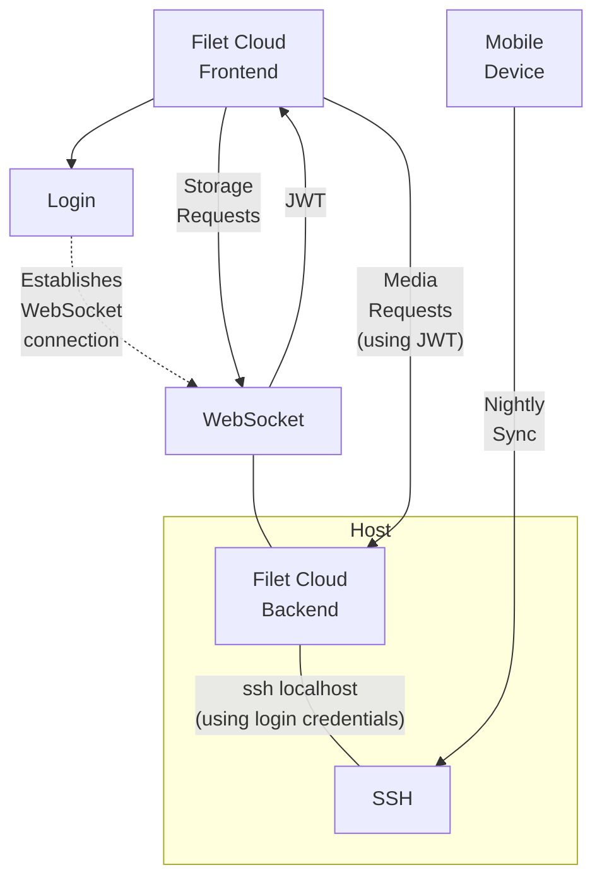

# ⛅ Filet Cloud
A simple and powerful personal cloud storage solution, with an elegant web interface.

Simple to self host, and adhering to the [file-over-app](https://stephango.com/file-over-app) philosophy, this gives you complete data privacy and full ownership over your own data. Its simple design provides a lean and fast web interface which connects via Websocket proxied SSH to the host's storage. You provision the storage host however you like, giving you full freedom on storage capacity.


Browse files, download, upload, stream videos and music, view images, create and edit documents.

## Features
* 📂 Browse folders.
* 📄 View and edit files in supported formats.
* 🖼 Fast preview viewing of thumbnail while large images load.
* ♫  Stream video and audio.
* 📂 Create new folders.
* 📄 Upload files.
* 🖊️ Rename files and folders.
* 📥 Download files.
* 🗄 Download multiple files or folders in a zip.
* 🚚 Move multiple files and folders.
* 🗑 Delete files and folders.
* 👤 Authentication via local SSH user account credentials.
* 📱 Compatible with automatic phone data upload tools like Folder Sync Pro via the STFP/SSH service running on the same server.
* 📱 Mobile friendly.
* 🔐 Be in full control of your own private data.
* 💾 Maintains file-system ownership integrity consistent with local access, and stores all data in files on the underlying filesystem for superior data longevity.
* 🖼 Embed images and thumbnails in markdown documents using relative paths.
* 🔗 Link to other content from markdown documents using relative paths.
* 🌓 Dark and light modes.
* ⌨ Fast keyboard navigation.
* 🖥 Terminal access to the storage host.
* 💪 Hardened security.
* 🧩 Active folder action plugins for creating custom commands which can autogenerate files such as photo albums, or disk usage reports.
* 🌏 Access from Firefox, Firefox mobile, Safari, Safari mobile, Chrome, Chrome mobile, and other Chromium based browsers.

## Design
This design for this solution favors simplicity and minimalism, both inside and out, without losing powerful features. *Filet Cloud* pushes a personal cloud solution to its leanest essence. It leaves you fully in control of your own data. It is a joy to use because it does what it needs to, reliably and quickly, and then gets out of the way. The primary design philosophy for this project is: **"complexity must justify itself, ruthlessly"**.



### Active Folder Action Plugins
Create action plugins within your backend storage folders to run commands which can generate, update and open files. These will be displayed as action buttons when navigating to the folder they reside in.

Active folder plugins must:
* Start with the prefix: `._filetCloudAction_` and end with the name of the action (with words separated by underscores), followed by an action icon (any character, unicode, or symbol). E.g: `._filetCloudAction_full_backup🗄`
* Either output nothing, or output the file or folder to redirect to when the action completes.
* Be executable.

This can be used for various actions, such as generating a photo album of all photos in a folder, displaying storage statistics, or even triggering a backup.

### Supported formats
* Images
* Videos
* Audio
* PDF documents
* Markdown (with editing)
* Text (with editing)

### Security
Since this service proxies SSH credentials, and both serves and modifies personal data, hardened security policies have been implemented. Please use a modern up-to-date browser and device to make full use of these protections. For full details, see [SECURITY.md](SECURITY.md).

Disclaimer: Use at your own risk. The codebase is strikingly small and the dependencies few, so the aim is that a security audit, for whosoever wishes to do it, should be as easy as possible. Nothing is secure until it is audited and reviewed by peers.

### Internals
The code is organised across a minimal number files as a result of a heavily opinionated focus on simplicity through reducing the complexities of code interconnectivity:
* [main.go](main.go) - the primary server.
* [resources/main.html](resources/main.html) - the main frontend browser page.

No frontend framework is used because adopting one on top of the simple interface design would have introduced unjustified complexity.

## Deployment
You can use the basic deployment guide below, or simply use one of the provided template deployments:
* Advanced Configuration: [Raspberry Pi 4 with BTRFS snapshotted 4TB HDD, Nginx, and an information control E-ink HAT](deployments/raspberry-pi-4-btrfs-hdd-nginx-with-hat/README.md).

### Build
Install dependencies and build:

```bash
wget https://cdn.jsdelivr.net/npm/pdfjs-dist@3.11.174/build/pdf.min.js -O resources/deps/pdf.min.js
wget https://cdn.jsdelivr.net/npm/pdfjs-dist@3.11.174/build/pdf.worker.min.js -O resources/deps/pdf.worker.min.js
wget https://cdn.jsdelivr.net/npm/easymde@2.18.0/dist/easymde.min.css -O resources/deps/easymde.min.css
wget https://cdn.jsdelivr.net/npm/easymde@2.18.0/dist/easymde.min.js -O resources/deps/easymde.min.js
wget https://cdn.jsdelivr.net/npm/xterm@5.3.0/lib/xterm.js -O resources/deps/xterm.js
wget https://cdn.jsdelivr.net/npm/xterm@5.3.0/css/xterm.css -O resources/deps/xterm.css
wget https://cdn.jsdelivr.net/npm/xterm-addon-fit@0.8.0/lib/xterm-addon-fit.js -O resources/deps/xterm-addon-fit.js
go build
```
This creates a single file executable that internally contains all required resources.

### Install
* Ensure your machine allows ssh from localhost.
* Setup a certficate for TLS and ensure your browser respects it.
* Start server:
```bash
FC_CERT_FILE=my.crt FC_KEY_FILE=my.key ./filet-cloud
```
* Open in browser. Eg: `https://localhost/`

### Launch Options
Supported environment variables:
* `FC_CERT_FILE` & `FC_KEY_FILE`: The credentials to use for TLS connections.
* `FC_DIR`: The folder path to use when serving storage, rather than the root. Supports a USERNAME token to serve a different tree for each user.
* `FC_DOMAIN`: The domain to use with the included Let's Encrypt integration. Use of this implies acceptance of the LetsEncrypt Terms of Service.
* `FC_LISTEN`: The address to listen on. Defaults to ':443'.
* `FC_SSH_PORT`: The port to use to connect locally.

### Certificate
If you don't have your own domain, you can set up TLS using a Self Signed Certificate with tools such as minica or openssl.

E.g, for testing locally:
```bash
openssl req -x509 -newkey rsa:4096 -sha256 -days 1 -nodes -keyout my.key -out my.crt -subj "/CN=localhost" -addext "subjectAltName=DNS:localhost,IP:127.0.0.1"
```

## Tricks and Tips
* The dynamic menu is contextual depending on what you have selected, and whether the cart mode is active or has contents.
* To use Copy/Paste in the terminal from a Linux client, use Ctrl/Shift+Insert rather than Ctr+c/v.
* Auto logout will cause terminal connections to end. Use a terminal multiplexer like zellij to provide persisent sessions across logins.
* NerdFont icons are fully supported and can be used for active folder plugin icons.
* Embed dynamically generated thumbnails inside markdown documents with the format suffix after the image path: ``. E.g: ``.

# TODO (Current WIP)
* Retest IOS, Chrome Mobile, Firefox Mobile.
* Installation enhancement pass:
  * Check if encryiption, hash, and crypto random fit hardward accelleration options on chosen devices.
  * Allow COLORTERM env though ssh.
  * Label RP4+HAT as Advanced Configuration.
    * Setup and test 2FA (and add to docs)
    * Storage status active folder plugin.
    * Full diagnostics active folder plugin (temp etc).
  * https - accept certs via env var or auto setup with let's encrypt autocert NewListener (with domain provided by FC_DOMAIN).
  * Make (zig?) lightweight optimised fcgenthumb command (libjpeg-turbo) & test speed opimisation.
  * Low Cost Simple deployment:
    * RP Zero W + 32GB MicroSD + Self Signed Certs + DynamicIP-fixer/0-cost + fcgenthumb.
    * Optional Additions: Case and Heatsink.
  * Energy Efficient High Capacity deployment:
    * RP Zero 2 W + Heatsink + 32GB MicroSD + Crucial X9 Pro 4TB + fcgenthumb + Basic Power Optimisation (disable things - https://picockpit.com/raspberry-pi/raspberry-pi-zero-2-battery/).
  * Wee-Mighty Deployment:
    * Radxa ZERO 3W + BEEFY custom heatsink + 512 MicroSD + Crucial X9 Pro 4TB + fcgenthumb + Power Optimisation.
    * Add RockChip Hardware acceleration variation of fcgenthumb (see https://github.com/Fruit-Pi/gstreamer-rockchip)
  * Commodity Hardware Repurpose Deployment:
    * Mobile phone version and 4G for always on.
    * Android Termix.
  * Backup active-folder plugin.
* Check todo list stored on cloud server.
* Update demo video (on firefox for mac with darkmode for better styling).
* Add brief demo video of portrait.
* Tag easily deployable release for others, with wide cross compiling ARM/x86/x64/RISC-V Linux/LinuxStaticMusl/Mac/Windows. Must have a 1.0.0

# Wishlist for Future Work
* Improve EasyMDE enabling a simpler integration, better parsing so images and links inside literals aren't resolved, add link and image manipulation via callbacks, and fix its bug when deactivating the preview button on refresh.
* Make as a Progressive Web App (PWA).
* Active folder action plugin for generating a photo album by making collection of markdown files for all photos in a folder.
* Active folder action plugin for getting storage statistics and status diagnostics.
* Improve CSP protection to inline stylesheets when xterm.js supports it. Other renderers or alternate tools could be options. See https://github.com/xtermjs/xterm.js/issues/4445
* Force selection in the terminal on macOS (https://github.com/xtermjs/xterm.js/issues/4329).
* Support for diagram editing and viewing.
* Reduce complexity through more consistent behaviour of major browsers.

# Thanks to
We stand on the shoulders of giants. They own this, far more than I do.
* https://stephango.com/file-over-app
* https://developer.mozilla.org/
* https://github.com/pkg/sftp
* https://github.com/gorilla/websocket
* https://golang.org/
* https://github.com/golang/crypto
* https://developer.mozilla.org/en-US/
* https://github.com/
* https://www.theregister.com
* https://www.nature.com/articles/s41586-021-03380-y
* https://stephango.com/file-over-app
* https://github.com/Ionaru/easy-markdown-editor
* https://mozilla.github.io/pdf.js/
* https://www.jsdelivr.com/
* https://github.com/AlDanial/cloc
* https://xtermjs.org/
* a world of countless open source contributors.
