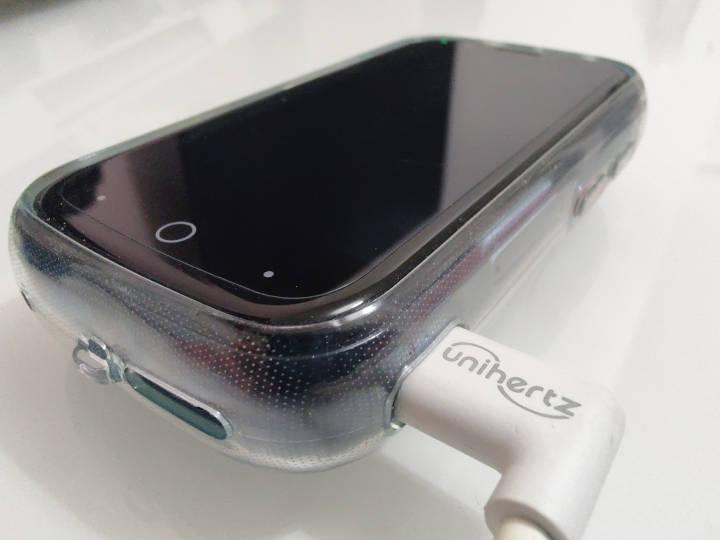

# ⛅ Filet Cloud: Deployment on an Upcycled Android using Termux App

This deployment aims to repurpose readily available e-waste.



## Hardware
* Any spare Android smartphone.

Tested against:
* Unihertz Jelly Star https://www.unihertz.com/products/jelly-star
* Redmi Note 8 Pro https://www.mi.com/uk/redmi-note-8-pro/
(or any other spare Android)

## Features
* 64GB - 256GB of storage (expandable with MicroSD).
* Builtin uninterruptible power supply.

## Setup
* Obtain an android phone.
* Install Termux (from Google Play Store or F-Droid).
* Install Termux:Boot.
* Open Termux.
* Set up a password with commands: `pkg update && pkg install && pkg upgrade && termux-auth && passwd`
* Setup FiletCloud and SSH:
  * Run the following command - note this will run admin commands on your device:
```bash
 pkg install wget && wget https://raw.githubusercontent.com/fuglaro/filet-cloud/main/deployments/android-termux/setup -O - | sh
```
  * This will run the setup and then it should display information on how to connect from your browser.
* You should now be able to access your Filet Cloud.
* Depending on the android phone, you may have to change the battery saver settings to allow Termux to stay active in the background. Disable App Blocker for all Termux apps, and set battery usage options to Unrestricted.
* If your Android still seems to go to sleep after a while, try keeping the screen on, but long pressing in Termux, selecting More, then setting: Keep Screen On.

## Metrics
* Idle power consumption: ~ 0.5W
* List folder speed: 25ms (tested with 8 entries over WiFi)
* Retrieve small file speed: 25ms (tested with 5KB file over WiFi)
* Retrieve big file wait time: 200ms (tested with 4.4MB JPEG over WiFi)
* Retrieve big file retrieval time: 600ms (tested with 4.4MB JPEG over WiFi)
