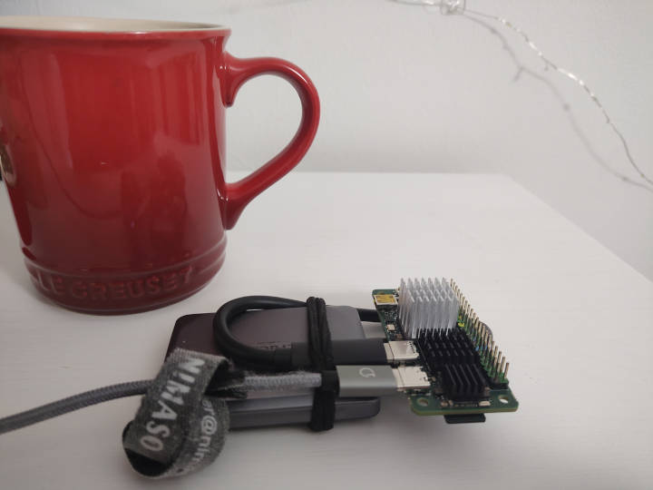

# ⛅ Filet Cloud: Wee Mighty - Low Profile Energy Efficient Deployment that packs a Mighty Performance Punch

This deployment aims to provide a meaty storage capacity and a powerful backend, with a low energy utilisation.



## Hardware
* Radxai Zero 3W https://radxa.com/products/zeros/zero3w/
* 1TB SanDisk Extreme Pro MicroSD https://www.westerndigital.com/en-gb/products/memory-cards/sandisk-extreme-pro-uhs-i-microsd?sku=SDSQXCD-1T00-GN6MA
* Crucial X9 Pro 4TB Portable External SSD https://uk.crucial.com/products/ssd/crucial-x9-pro-ssd
* Heatsink https://arace.tech/products/heatsink-5519a-for-radxa-zero-3w-radxa-zero-3e

## Features
* 1TB of OS storage.
* 4TB of data storage.
* Automatic TLS Certificate renewal.
* Connect from your local network or via your personal domain.
* Automatic OS updates.
* Simple single user setup.
* Powerful backend.
* Maintains filesystem ownership integrity consistent with local access.
* SFTP compatibility, (compatibility with many phone syncronisation apps which support SFTP, NAS via SFTP)
* Supports multiple users.
* Daily snapshots (with Btrfs). Note there is no hardware resiliant backup redundancy - please set up a strategy for resiliency against hardware failure which suits your needs.
* COLORTERM environment variable is passed through from filet-cloud terminal connections, setting the value to `truecolor`.

## Setup
* Format the USB drive (for the data) as btrfs (https://wiki.archlinux.org/title/Btrfs).
* Install the OS on the MicroSD card: https://docs.radxa.com/en/zero/zero3/getting-started/install-os.
* Connect everything.
* Boot and log in as `radxa` with password `radxa`.
* Open a terminal to run initial setup:
  * Run `sudo rsetup` to connect to WiFi, run a system update (note that `apt upgrade` is dangerous with radxa devices), and optionally set the hostname.
  * Create a new user with your own login name:
    * `sudo adduser `<USERNAME>``
    * `sudo usermod -aG sudo,audio,video,plugdev,render,i2c,gpio,spidev,pwm `<USERNAME>``
  * Disable login of the default radxa user for security:
    * `sudo passwd -l radxa`
  * From here the remainder of the setup can be done via SSH (to <HOSTNAME>.local) using your new login. You may prefer to now set up the device in headless mode and connect in this way.
* Run the following command - note this will run admin commands on your device:
```bash
 wget https://raw.githubusercontent.com/fuglaro/filet-cloud/main/deployments/radxa-zero-3w-btrfs-ssd/setup -O - | sh
```
* Setup port forwarding (22,80,443) with your router, and setup your domain so it resolves to your IP. 
* Setup phone sync on your devices with apps like Folder Sync Pro.

## Metrics
* Idle power consumption: ~ 2.2W (suspect major improvements available with device idle optimisations)
* List folder speed: ms (tested with 8 entries over WiFi)
* Retrieve small file speed: ms (tested with 5KB file over WiFi)
* Retrieve big file wait time: ms (tested with 4.4MB JPEG over WiFi)
* Retrieve big file retrieval time: s (tested with 4.4MB JPEG over WiFi)
* Retrieve big file thumbnail wait time: s (tested with 4.4MB JPEG over WiFi)
* Retrieve big file thumbnail time: ms (tested with 4.4MB JPEG over WiFi)
