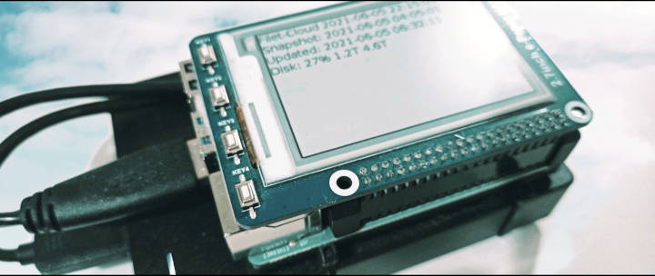

# ⛅ Filet Cloud: Deployment on Raspberry Pi 4 with BTRFS HDD and an E-Ink Hat

The original deployment of Filet Cloud. This deployment is now, after many later improvements to Filet Cloud, unneccessarily complex, but still serves as a good example for deeper customisation.



## Original Goals
This deployment attempted to make a sophisticated personal cloud storage solution similar to the google-drive ecosystem, using the design philosophies of the filet project series. This project, like others in the series, aggressively pushed for code minimalism and the essence of simplicity. The success of the project led to further features and enhancements, but with all added complexity having to justify itself, ruthlessly.

How is this different to existing services like Google Drive or solutions like NextCloud?
* Take control of your privacy.
* Storage sizes are only limitted by your hardware.
* Solution that favours reliability and simplicity over feature-creep.
* Fast, featured, and simple web interface that runs over a standard filesystem and never gets out of sync.
* Supports multiple accounts within an organisation without the complexity of web-admin interfaces. Account management is as simple as using Linux user accounts and SSH authentication.

It targets a build running on a Raspberry Pi 4 with an E-ink display hat that displays status information.

## Additional Features
* Maintains filesystem ownership integrity consistent with local access.
* SFTP compatibility.
  * Compatibility with many phone syncronisation apps which support SFTP.
  * NAS via SFTP.
* Automatic OS updates.
* Supports multiple users.
* Device e-ink display:
  * Last snapshot time.
  * Last update time.
  * Disk usage and free space.
* Device controls (buttons):
  * Safe shutdown.
  * Create snaphot.
  * Trigger update and restart.
* Daily snapshots (with Btrfs).
* 4 TB of storage.
* Note there is no hardware resiliant backup redundancy - please set up a strategy for resiliency against hardware failure which suits your needs.
* COLORTERM environment variable is passed through from filet-cloud terminal connections, setting the value to `truecolor`.
* 2FA with google-authenticator.

## Hardware
The following hardware was used for this build:
* Raspberry Pi 4B 4GB https://www.raspberrypi.org/products/raspberry-pi-4-model-b/
* 32GB Transcend microSDXC/SDHC 300S https://www.transcend-info.com/Products/No-948
* Seagate 5TB Basic Portable External Drive https://www.seagate.com/gb/en/products/external-hard-drives/basic-external-hard-drive/
* 2.7inch Mono E-Ink display (with 4 buttons) https://www.waveshare.com/wiki/2.7inch_e-Paper_HAT
* Head sink case https://shop.pimoroni.com/products/aluminium-heatsink-case-for-raspberry-pi-4

## Setup
### Basic Host Setup
* Install Raspberry Pi OS to a microSD card (https://www.raspberrypi.org/software/)
* Enable ssh on your Pi (https://www.raspberrypi.org/documentation/remote-access/ssh/)
* Make a better password for the pi user (https://www.raspberrypi.org/documentation/configuration/security.md)
* Set up WiFi if needed (https://www.raspberrypi.org/documentation/configuration/wireless/).
* If you intend to connect from outside your local network, setup port forwarding for desired ports (https://en.wikipedia.org/wiki/Port_forwarding), static DHCP, and dynamic DNS, if needed (https://wiki.archlinux.org/title/Dynamic_DNS).
  * Port 22: SFTP and full SSH access (https://wiki.archlinux.org/title/SFTP_chroot)
  * Port 80 and 443: Web UI access via TLS - Port 80 is only open for TLS certificate renewal.
* Ensure you have connected power, network, an empty USB drive to store the data, inserted the SD Card, and disconnected all other USB drives, then power on.

### USB Drive Setup
* Format the USB drive (for the data) as btrfs (https://wiki.archlinux.org/title/Btrfs).

### Filet-Cloud Installation
```bash
ssh pi@raspberrypi.local
git clone https://github.com/fuglaro/filet-cloud.git
cd filet-cloud/deployments/raspberry-pi-4-btrfs-hdd-nginx-with-hat
sudo ./install
```

### Create New Login Account:
```bash
filet-cloud-new-user
```
## Phone Cloud Syncing
Setup nightly media and photo backups from your mobile device.

* Android filesyncer - Folder Sync or Folder Sync Pro

## Metrics
* Idle power consumption: ~ 3.2W (this has not been optimised and could be improved by managing an idle state including spinning down the HDD)
* List folder speed: 11ms (tested with 5 entries over WiFi)
* Retrieve small file speed: 11ms (tested with 5KB file over WiFi)
* Retrieve big file wait time: 50ms (tested with 4.4MB JPEG over WiFi)
* Retrieve big file retrieval time: 550ms (tested with 4.4MB JPEG over WiFi)
* Retrieve big file thumbnail wait time: 600ms (tested with 4.4MB JPEG over WiFi)
* Retrieve big file thumbnail time: 0ms (tested with 4.4MB JPEG over WiFi)
