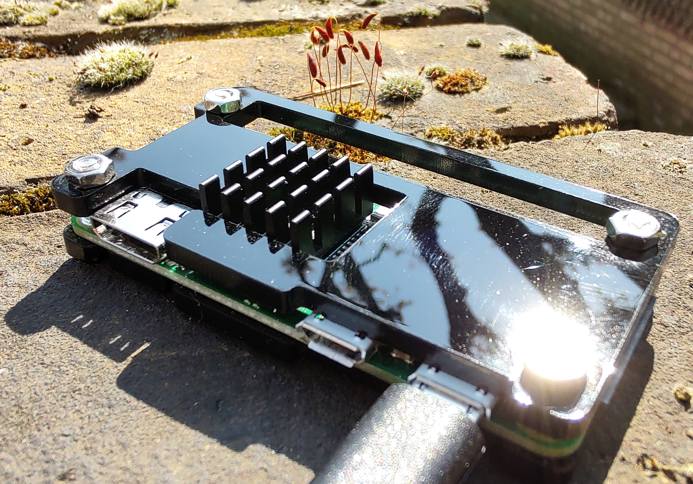

# ⛅ Filet Cloud: Low Cost Simple Deployment on Raspberry Pi Zero W

This deployment aims to be the simplest, easiest, and cheapest option.



## Hardware
* Raspberry Pi Zero W https://www.raspberrypi.com/products/raspberry-pi-zero-w/
* 32GB SanDisk Ultra MicroSD https://www.westerndigital.com/en-gb/products/memory-cards/sandisk-ultra-uhs-i-microsd
* Optional extras:
  * Case and Heatsink (kit): https://www.amazon.com/iUniker-Raspberry-Starter-Acrylic-Clear/dp/B075FMKWB9

## Features
* Easy Setup.
* Connect from your local network.
* Automatic OS updates.
* ~24GB of storage

## Setup
* Use the Raspberry Pi Imager to setup a new bootable SD Card:
  * See: https://www.raspberrypi.com/documentation/computers/getting-started.html#raspberry-pi-imager
  * Choose the device: Raspberry Pi Zero.
  * Choose the OS: Raspberry Pi OS Lite (32-Bit).
  * Choose the storage.
  * Edit the OS customisation settings:
    * Set hostname: filetcloud
    * Set your username and password, ensuring a very strong password.
    * Configure the wireless LAN.
    * Enable SSH.
* Insert the SD Card.
* Power on the Raspberry Pi.
* Setup FiletCloud:
  * Connect to the Pi via SSH using your username: `ssh username@filetcloud.local`
  * Run the following command - note this will run admin commands on your device:
```bash
 wget https://raw.githubusercontent.com/fuglaro/filet-cloud/main/deployments/raspberry-pi-zero-w-sdcard-no-domain/setup -O - | sudo sh
```
* You should now be able to access your Filet Cloud from any device on your home network: `https://filetcloud.local/`

## Metrics
* Idle power consumption: ~ 0.5W
* List folder speed: 25ms (tested with 8 entries over WiFi)
* Retrieve small file speed: 40ms (tested with 5KB file over WiFi)
* Retrieve big file wait time: 200ms (tested with 4.4MB JPEG over WiFi)
* Retrieve big file retrieval time: 8.5s (tested with 4.4MB JPEG over WiFi)
* Retrieve big file thumbnail wait time: 7s (tested with 4.4MB JPEG over WiFi)
* Retrieve big file thumbnail time: 0ms (tested with 4.4MB JPEG over WiFi)
